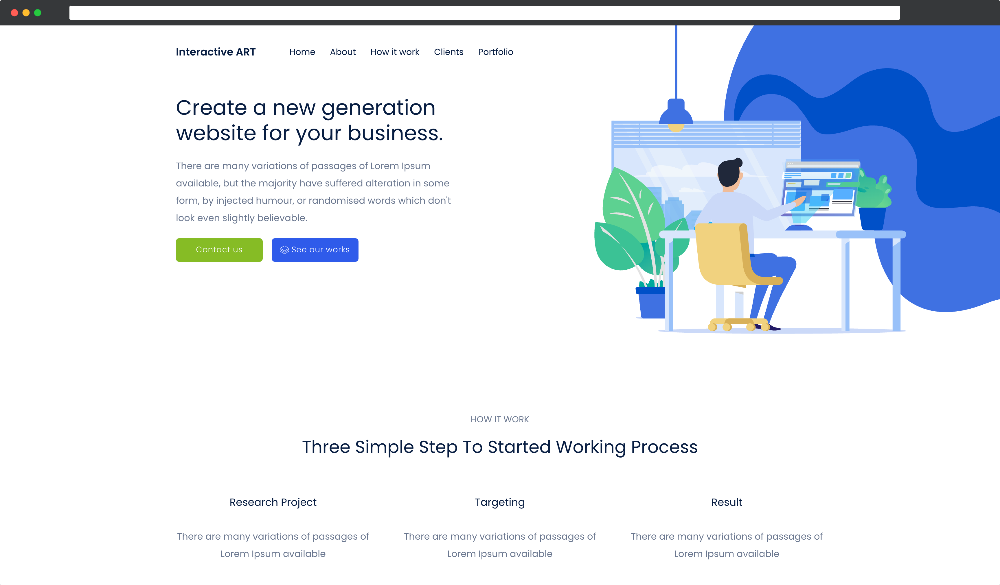

## INTERACTIVE ART

***Website advertising agencies***
1. Made HTML-markup of all pages and all elements on the pages.
2. One style file for all pages.
3. Optimized the entire schedule.
4. Implementation of the mobile menu using vanilla JavaScript.
5. The document is being tested for validity [http://validator.w3.org](http://validator.w3.org/)
6. Adaptive layout is implemented using media queries.

