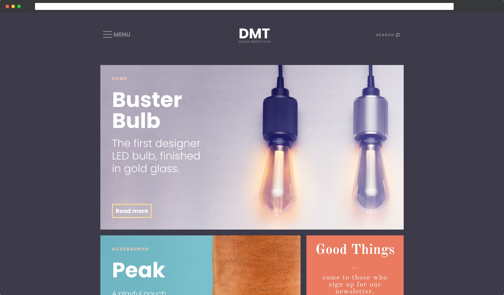

# DMT - Design Meets Tech
***Training layout on the subject of "Interior Design".***
1. Made HTML-markup of all pages and all elements on the pages.
2. One style file for all pages.
3. Optimized the entire schedule.
4. The document is being tested for validity [http://validator.w3.org](http://validator.w3.org/)
5. Adaptive layout is implemented using media queries.
6. Google Lighthouse: Performance - 99; Accessibility - 92;

