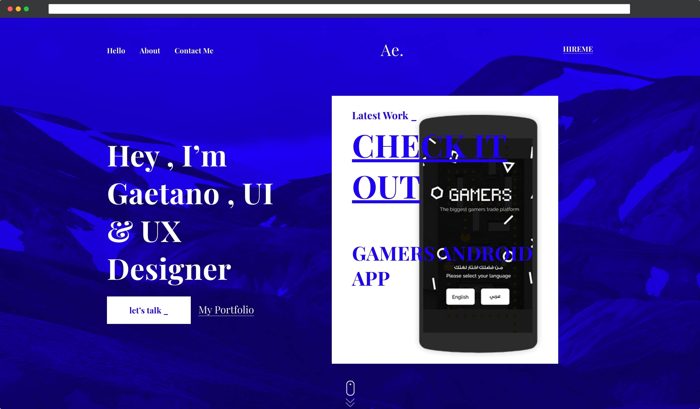

# «Ae» - Portfolio One Page Template

***A cool & free portfolio template for you to create a creative personal website in which you can place your skills, informations and work so that your future clients can see it..***
1. Made HTML-markup of all pages and all elements on the pages.
2. One style file for all pages.
3. Optimized the entire schedule.
4. Implementation of the scroll down using vanilla JavaScript.
5. The document is being tested for validity [http://validator.w3.org](http://validator.w3.org/)
6. Adaptive layout is implemented using media queries.
7. Google Lighthouse: Performance - 90+; Accessibility - 90+;

